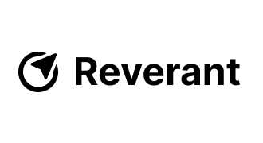
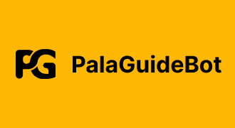

<div align="center">
    <a href="https://git.io/typing-svg"></a>
</div>

<div align="center">
    <a href="https://www.linkedin.com/in/noah-lebreton-449788311/"></a>
</div>

## About me... 

I am an IT student undergoing a career transition, currently pursuing a specialization certificate in cybersecurity. My personal projects have helped me develop strong self-learning skills and fueled my curiosity for various fields of computer science. Dedicated and motivated, I am continuously building my technical skills through both academic and personal projects, driven by a strong desire to keep learning and growing.

## Skills

```javascript
const ZELUCK = {
    OS: ["Ubuntu", "Debian", "Windows"],
    languages: {
        averageLevel: ["JavaScript"],
        baseLevel: ["Java", "Typescript", "Bash", "Python"]
    },
    programming: {
        backend: ["AdonisJS"],
        frontend: ["HTML", "CSS", "React", "TailWindCSS", "Shadcn"],
        databases: ["PostgreSQL", "MongoDB", "MySQL"],
        bots: ["DiscordJS"],
        devOps: ["Docker", "Nginx", "Traefik"],
    },
    UI_UX: ["Figma"],
};
```

## My Organizations

<div align="center">
<table>
<tr>
<td><a href="https://github.com/reverant-org/"></a></td>
<td><a href="https://github.com/PalaGuideBot/"></a></td>
</tr>
</table>
</div>